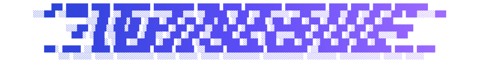

<p align="center">
  
</p>

<p align="center">
<em>a 3D map of the most linked domains on the web: a domain is a point, a link is a line</em>
</p>

<hr/>
<br/>

<p align="center">
  <a href="https://github.com/SPTApyo/NetNebula/actions/workflows/build_graph.yml"></a>
  <a href="https://github.com/SPTApyo/NetNebula/actions/workflows/firebase-hosting-merge.yml"></a>
  <a href="https://netnebula-eb9eb.web.app/"></a>
  
  <a href="https://github.com/SPTApyo/NetNebula/commits/main"></a>
</p>

**NetNebula** maps the web at the scale of domains. Instead of crawling page by page, it reads the domain-level web graph that [Common Crawl](https://commoncrawl.org/web-graphs) publishes for each release: over 100 million domains and billions of links. It keeps the 20,000 most central ones, groups them into communities, and draws each community as its own galaxy in a 3D sky you can fly through.

**[Open the live map](https://netnebula-eb9eb.web.app/)**

## Features

- **The real web, not a crawl sample**: built from the Common Crawl domain graph, refreshed on every new release.
- **Meaningful links**: each domain keeps 8 outgoing links, reciprocal ones first, then the least cited targets, because linking to a niche site says more than linking to a giant.
- **Communities as galaxies**: domains are clustered by topic and each cluster gets its own 3D layout and color.
- **No noise**: CDNs, APIs, trackers and URL shorteners are filtered out.
- **Fully static**: one graph.json file, drawn with WebGL2. No database, no backend.
- **Light and dark themes**: switch with a wave that sweeps across the sky.

## How it works

```text
Common Crawl ──> pipeline/build_graph.py ──> public/graph.json ──> public/ (Firebase Hosting)
  ranks, vertices, edges     filter, communities, layout        WebGL2 viewer
```

1. The ranks file is sorted by harmonic centrality, so the top domains are read from its first lines. Infrastructure domains are skipped.
2. The vertices file maps them to ids, and one streamed pass over the edges file (about 9 GB) keeps the links between them.
3. Each domain keeps its 8 most telling links: reciprocal ones first, then the least cited targets.
4. igraph finds the communities and lays each one out in 3D.
5. Everything is written to public/graph.json, about 2.3 MB for 20,000 domains and 131,000 links.

Nothing is stored between runs: the pipeline is a stateless job.

# Getting Started

NetNebula needs **[uv](https://docs.astral.sh/uv/)** (it installs Python 3.11+ and igraph), and the **Firebase CLI** to serve or deploy the site.

## Setup

With Nix:
```bash
nix develop
```

Without Nix:
```bash
uv sync --project pipeline
npm install -g firebase-tools
```

# Usage

```bash
npm run test           # pipeline tests, no network
npm run graph:small    # 2,000-domain graph
npm run graph          # full graph, about 7 minutes, 9 GB streamed
npm run serve          # local site on http://localhost:5000
npm run deploy         # publish to Firebase Hosting
```

### Pipeline options
- --size N: number of domains (default: 20000).
- --keep N: outgoing links kept per domain (default: 8).
- --release ID: Common Crawl graph id (default: latest).
- --out FILE: output file (default: public/graph.json).

### Controls
- Drag to look, WASD to fly, double-click a domain to focus.
- T: view all, H: random domain, P: pause, L: light or dark theme.
- Search filters domains, Enter flies to the first match.

# CI/CD

- **build_graph.yml**: on the 5th of each month and on demand. Runs the tests, rebuilds the graph when Common Crawl has a new release, commits public/graph.json and deploys.
- **firebase-hosting-merge.yml**: tests, then deploy on every push to main.
- **firebase-hosting-pull-request.yml**: tests, then a preview channel for each pull request.

# Community

For bugs, feature requests, and contributions, please use the [Issue Tracker](https://github.com/SPTApyo/NetNebula/issues).

Web graph data by [Common Crawl](https://commoncrawl.org/).

Made with ❤️ by [SPTApyo](https://github.com/SPTApyo).

# License

This software is distributed under the **MIT License**.

Copyright (c) 2026 SPTApyo
